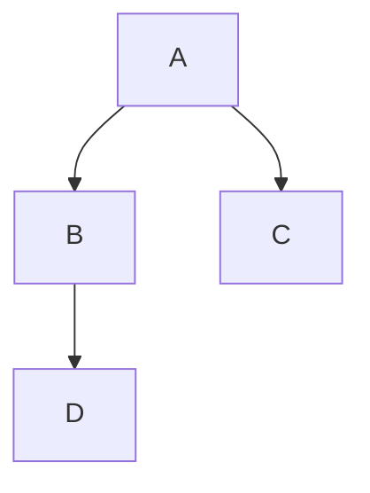

# 什么是动态规划
动态规划，英文：Dynamic Programming，简称DP，如果某一问题有很多重叠子问题，使用动态规划是最有效的。

所以动态规划中每一个状态一定是由上一个状态推导出来的，这一点就区分于贪心，贪心没有状态推导，而是从局部直接选最优的，

例如：有N件物品和一个最多能背重量为W 的背包。第i件物品的重量是weight[i]，得到的价值是value[i] 。每件物品只能用一次，求解将哪些物品装入背包里物品价值总和最大。

动态规划中dp[j]是由dp[j-weight[i]]推导出来的，然后取max(dp[j], dp[j - weight[i]] + value[i])

# 动态规划的解题步骤
对于动态规划问题，我将拆解为如下五步曲。
1. 确定dp数组（dp table）以及下标的含义
2. 确定递推公式
3. dp数组如何初始化
4. 确定遍历顺序
5. 举例推导dp数组

%% 示例：基础脑图结构
